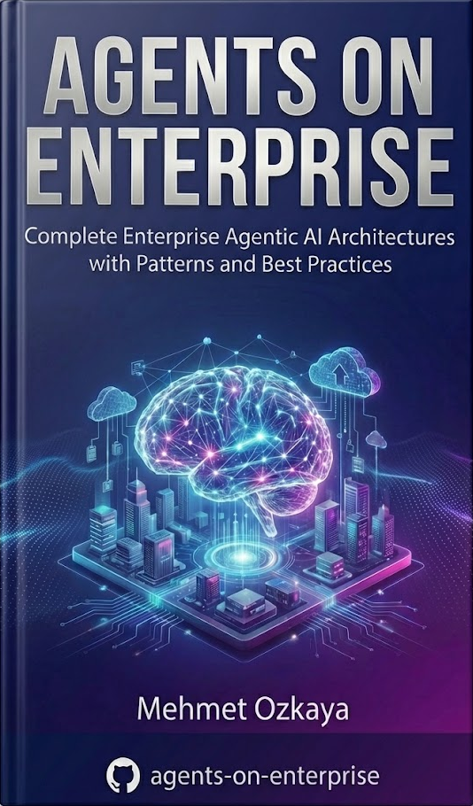

<div align="center">

# 🤖 Agents for Enterprise

**Complete Enterprise Agentic AI Architectures with .NET**

<a href="https://agentsonenterprise.com/">
  
</a>

*Build Production-Grade AI Systems for Senior .NET Architects & Tech Leads*

[](https://agentsonenterprise.com/)

[🚀 Quick Start](#-quick-start) • [📚 Table of Contents](#-whats-inside) • [🏗️ Architecture](#-architecture-patterns) • [💬 Community](#-community)

</div>

---

## 🎯 Why This Book?

> **"You're a Senior Architect, but AI makes you feel like a Junior again."**

You've tried to learn Agentic AI, but everything is in **Python** or focused on simple scripts that crumble in a real enterprise environment. **You don't need another "Hello World" tutorial.** You need to handle latency, security, and state management in a distributed C# system.

<details>
<summary><strong>📋 This Book is For You If...</strong></summary>

- ✅ You're a **Software Developer, Architect, or Tech Lead** working in enterprise environments
- ✅ You need to **integrate AI agents into existing microservices** and backend systems
- ✅ You want to build with **.NET and C#**—not switch to Python
- ✅ You require **production-grade patterns** for security, observability, and scalability
- ✅ You're adding **AI features to legacy systems** and need enterprise-ready solutions

</details>

---

## 🏗️ What You'll Master

| Capability | Description |
|:---|:---|
| **Microsoft Agent Framework** | Deep dive into Microsoft's official agent framework for building sophisticated AI systems |
| **Multi-Agent Orchestration** | Design and implement complex workflows with multiple cooperating agents |
| **Agentic RAG Systems** | Build retrieval-augmented generation systems that go beyond simple Q&A |
| **Enterprise Security** | Implement guardrails, PII redaction, rate limiting, and compliance controls |
| **Observability & Tracing** | Full OpenTelemetry integration with .NET Aspire for production monitoring |
| **Azure Foundry Deployment** | Deploy and scale your agent systems on Azure with confidence |

---

## 📚 What's Inside

This comprehensive guide takes you from foundational concepts to production-ready enterprise deployments across **8 parts** and **26 chapters**:

| Part | Title | Description |
|:---:|:---|:---|
| I | [Foundations](./part-01-foundations/README.md) | Understanding AI agents—why they matter, what they are, and their core components |
| II | [Explore & Setup](./part-02-explore/README.md) | Navigate the AI landscape and configure your .NET development environment |
| III | [Core Development](./part-03-core/README.md) | Build agents with tools, memory, streaming, and structured outputs |
| IV | [Multi-Agent](./part-04-multi-agent/README.md) | Design workflows with multiple cooperating agents and orchestration |
| V | [Agentic RAG](./part-05-agentic-rag/README.md) | Retrieval-augmented generation systems for enterprise knowledge |
| VI | [Communications](./part-06-communications/README.md) | A2A, MCP, AG-UI protocols for agent interoperability |
| VII | [Advanced](./part-07-advanced/README.md) | Middleware, skills architecture, and advanced reasoning patterns |
| VIII | [Enterprise](./part-08-enterprise/README.md) | ADLC, observability, security, deployment, and cost management |

<details>
<summary><strong>📖 View All 26 Chapters</strong></summary>

### Part I: Foundations of AI Agents
| Chapter | Topic | Description |
|:---:|:---|:---|
| 01 | [Why Agents](./part-01-foundations/01-why-agents/README.md) | Understanding the motivation and strategic value of AI agents in enterprise |
| 02 | [AI Agents](./part-01-foundations/02-ai-agents/README.md) | What AI agents are and how they differ from traditional software systems |
| 03 | [Components](./part-01-foundations/03-components/README.md) | Core architectural components that make up a production AI agent |

### Part II: Explore AI Landscape and Setup Agent Environment
| Chapter | Topic | Description |
|:---:|:---|:---|
| 04 | [Frameworks](./part-02-explore/04-frameworks/README.md) | Overview of agent frameworks—Microsoft Agent Framework, Semantic Kernel, and more |
| 05 | [Ecosystem](./part-02-explore/05-ecosystem/README.md) | The broader AI agent ecosystem, tools, and enterprise integrations |
| 06 | [Setup](./part-02-explore/06-setup/README.md) | Setting up your .NET development environment for building agents |

### Part III: Core Agent Development—Mechanics, Tools, and Memory
| Chapter | Topic | Description |
|:---:|:---|:---|
| 07 | [Getting Started](./part-03-core/07-getting-started/README.md) | Hands-on guide to building your first AI agent with streaming and structured outputs |
| 08 | [Tool Use](./part-03-core/08-tool-use/README.md) | Function calling, code interpretation, file search, and web search capabilities |
| 09 | [Memory](./part-03-core/09-memory/README.md) | Session management, context providers, and persistent memory with Cosmos DB |

### Part IV: Multi-Agent Workflows and Orchestration
| Chapter | Topic | Description |
|:---:|:---|:---|
| 10 | [Workflows](./part-04-multi-agent/10-workflows/README.md) | Agentic workflow patterns, checkpoints, and human-in-the-loop orchestration |

### Part V: Agentic RAG (Retrieval-Augmented Generation)
| Chapter | Topic | Description |
|:---:|:---|:---|
| 11 | [Agentic RAG Concepts](./part-05-agentic-rag/11-agentic-rag/README.md) | Understanding agentic RAG architecture and design patterns |
| 12 | [Develop Agentic RAG](./part-05-agentic-rag/12-develop-agentic-rag/README.md) | Building RAG systems with Qdrant vector stores and enterprise data sources |

### Part VI: Agent Communications and Protocols
| Chapter | Topic | Description |
|:---:|:---|:---|
| 13 | [Communications](./part-06-communications/13-communications/README.md) | Agent communication strategies and protocol design |
| 14 | [Agent-to-Agent (A2A)](./part-06-communications/14-a2a/README.md) | Building enterprise compliance services with agent-to-agent protocols |
| 15 | [Model Context Protocol (MCP)](./part-06-communications/15-mcp/README.md) | Implementing MCP with GitHub integration and governance examples |
| 16 | [AG-UI Protocol](./part-06-communications/16-ag-ui/README.md) | Agent-to-UI communication patterns with client-server architecture |
| 17 | [Developer UI](./part-06-communications/17-devui/README.md) | Building enterprise KYC services with developer-friendly interfaces |

### Part VII: Advanced Agent Development—Middleware, Skills, and Reasoning
| Chapter | Topic | Description |
|:---:|:---|:---|
| 18 | [Middleware](./part-07-advanced/18-middleware/README.md) | Enterprise middleware patterns—guardrails, PII redaction, rate limiting |
| 19 | [Skills](./part-07-advanced/19-skills/README.md) | Enterprise skills architecture for composable agent capabilities |
| 20 | [Reasoning](./part-07-advanced/20-reasoning/README.md) | Advanced reasoning patterns for complex decision-making agents |

### Part VIII: Enterprise Considerations—ADLC, Observability, Evaluations, and Security
| Chapter | Topic | Description |
|:---:|:---|:---|
| 21 | [ADLC](./part-08-enterprise/21-adlc/README.md) | Agent Development Lifecycle—from design to production |
| 22 | [Observability](./part-08-enterprise/22-observability/README.md) | Full observability with .NET Aspire and OpenTelemetry |
| 23 | [Evaluation](./part-08-enterprise/23-evaluation/README.md) | Testing, evaluation frameworks, and quality assurance for AI agents |
| 24 | [Security](./part-08-enterprise/24-security/README.md) | Enterprise security architecture and compliance patterns |
| 25 | [Deployment](./part-08-enterprise/25-deployment/README.md) | Azure Foundry deployment strategies and cloud-native patterns |
| 26 | [Cost Management](./part-08-enterprise/26-cost/README.md) | Cost optimization strategies for enterprise AI systems |

</details>

---

## 🛠️ Technology Stack

<div align="center">

| Category | Technologies |
|:---|:---|
| **Languages & Frameworks** | .NET 10 • C# • ASP.NET Core |
| **AI & Agents** | Microsoft Agent Framework • Semantic Kernel • Azure OpenAI |
| **Cloud & Deployment** | Azure Foundry • Azure Container Apps • Azure Kubernetes Service |
| **Observability** | .NET Aspire • OpenTelemetry • Application Insights |
| **Data & Storage** | Cosmos DB • Qdrant • Azure Blob Storage |
| **Architecture** | Microservices • Clean Architecture • Domain-Driven Design |

</div>

---

## 🚀 Quick Start

### Prerequisites

- [.NET 10 SDK](https://dotnet.microsoft.com/download)
- [Visual Studio 2026](https://visualstudio.microsoft.com/) or [VS Code](https://code.visualstudio.com/)
- [Azure Subscription](https://azure.microsoft.com/free/) (for cloud deployments)
- [Docker Desktop](https://www.docker.com/products/docker-desktop/) (for local development)

### Clone and Run

```bash
# Clone the repository
git clone https://github.com/mehmetozkaya/agents-on-enterprise.git
cd agents-on-enterprise

# Navigate to your first agent
cd part-02-explore/06-setup/HelloAgent

# Set environment variables (PowerShell)
$env:AZURE_OPENAI_ENDPOINT="https://your-resource.openai.azure.com/"  # Replace with your Azure OpenAI resource endpoint
$env:AZURE_OPENAI_DEPLOYMENT_NAME="gpt-5-mini"  # Optional, defaults to gpt-5-mini

# Run the agent
dotnet run
```

---

## 📐 Architecture Patterns

This repository demonstrates enterprise-grade architectural patterns including:

```
┌─────────────────────────────────────────────────────────────────┐
│                    Enterprise Agent Architecture                │
├─────────────────────────────────────────────────────────────────┤
│  ┌─────────────┐  ┌─────────────┐  ┌─────────────┐              │
│  │   Agent 1   │  │   Agent 2   │  │   Agent N   │   Agents     │
│  │  (Planner)  │  │ (Executor)  │  │  (Expert)   │              │
│  └──────┬──────┘  └──────┬──────┘  └──────┬──────┘              │
│         │                │                │                     │
│  ┌──────┴────────────────┴────────────────┴──────┐              │
│  │              Orchestration Layer              │   Workflow   │
│  │     (Multi-Agent Coordination & Routing)      │              │
│  └──────────────────────┬───────────────────────-┘              │
│                         │                                       │
│  ┌──────────────────────┴───────────────────────┐               │
│  │              Middleware Pipeline             │   Security    │
│  │  (Guardrails • PII • Rate Limiting • Auth)   │               │
│  └──────────────────────┬───────────────────────┘               │
│                         │                                       │
│  ┌──────────────────────┴───────────────────────┐               │
│  │            Enterprise Services               │   Backend     │
│  │    (RAG • Memory • Tools • Integrations)     │               │
│  └──────────────────────┬───────────────────────┘               │
│                         │                                       │
│  ┌──────────────────────┴───────────────────────┐               │
│  │              Observability Layer             │   Ops         │
│  │   (OpenTelemetry • Tracing • Metrics)        │               │
│  └──────────────────────────────────────────────┘               │
└─────────────────────────────────────────────────────────────────┘
```

---

## 💬 Community

- 🌐 **Website**: [agentsonenterprise.com](https://agentsonenterprise.com/)
- 📧 **Contact**: Questions? Reach out through the website
- ⭐ **Star this repo** if you find it valuable!

---

## 📄 License

This repository contains code samples and examples from the **Agents for Enterprise** book. The code is provided for educational purposes.

For the complete learning experience including detailed explanations, architectural diagrams, and enterprise patterns, [get the full book](https://agentsonenterprise.com/).

---

<div align="center">

### Ready to Build Production-Grade AI Agent Systems?

[](https://agentsonenterprise.com/)

**Stop translating Python scripts. Start building enterprise AI with .NET.**

---
</div>
